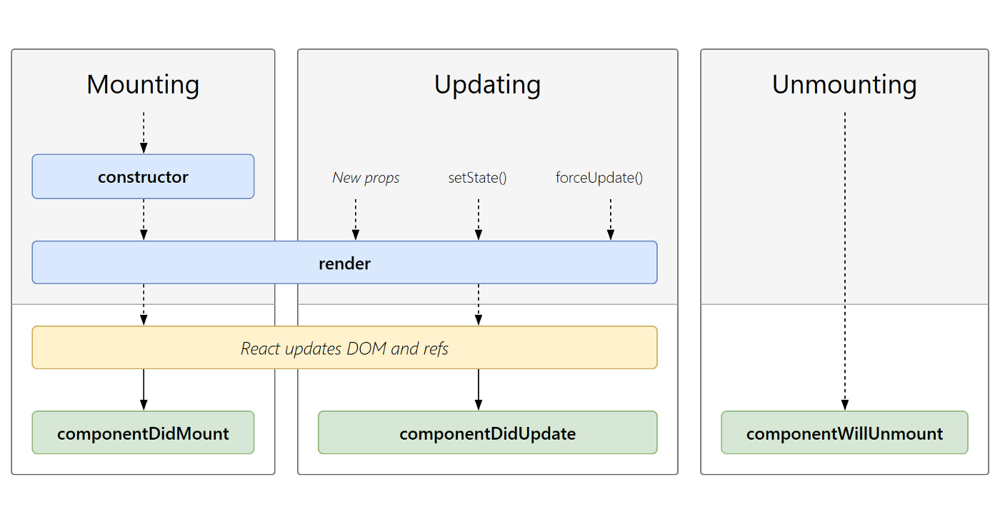
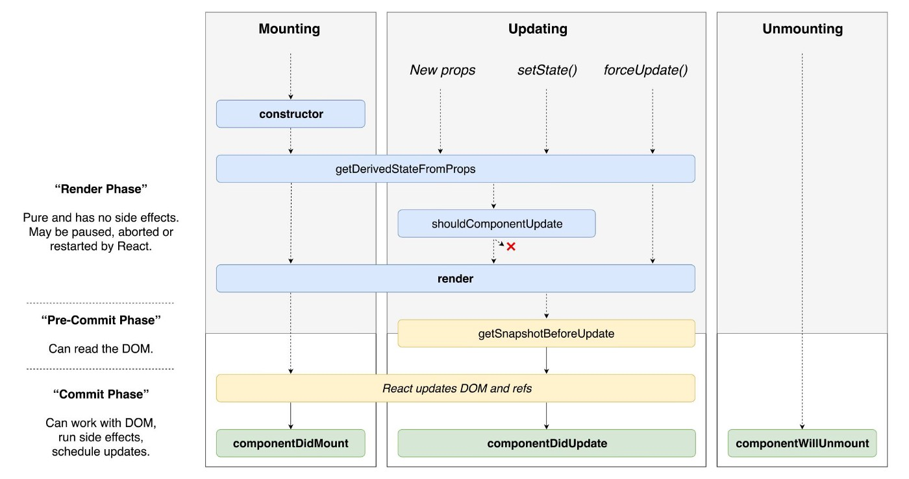

# React 시작하기
- [React](#react)
- [Lifecycle](#lifecycle)
- [React 앱 만들기](#react-앱-만들기)
    - [Create React App](#create-react-app)
    - [NODE_ENV 설정](#node_env-설정)
    - [React Router](#react-router)
    - [history](#history)
    - [PUBLIC_URL](#public_url)
- [React vs Vue](#react-vs-vue)

<br>
<br>

## React
[사용자 인터페이스를 만들기 위한 js 라이브러리](https://reactjs.org/)
- 컴포넌트 기반
- Virtual DOM 사용
- [Flux 패턴](http://webframeworks.kr/tutorials/react/flux/)

<br>
<br>

## Lifecycle
[컴포넌트 생명주기](https://ko.reactjs.org/docs/react-component.html#the-component-lifecycle)   
컴포넌트가 생성되고 사용되고 소멸될 때까지의 과정을 lifecycle이라 말하고 이 Lifecycle 안에서 특정 시점에 자동으로 호출되는 메서드를 Lifecycle event라고 한다.  



More details



<br>
<br>

## React 앱 만들기
[새로운 React 앱 만들기](https://ko.reactjs.org/docs/create-a-new-react-app.html)

<br>

### Create React App
```
$ npx create-react-app react-router-tutorial
$ cd react-router-tutorial
$ npm start
```

<br/>

### NODE_ENV 설정
[cross-env 환경변수 설정 라이브러리](https://www.npmjs.com/package/cross-env)  
프로젝트 루트 경로 설정
```
$ npm install cross-env --dev
```
package.json
```
"scripts": {
    "start": "cross-env NODE_PATH=src react-scripts start",
    "build": "cross-env NODE_PATH=src react-scripts build",
    "test": "react-scripts test --env=jsdom",
    "eject": "react-scripts eject"
  }
```

<br/>

### React Router
[React Router](https://reacttraining.com/react-router/web/guides/quick-start)  
url 주소에 따라 view를 나누기 위해 설치
```
$ npm install react-router-dom
```
/src/App.js
```
import React, { Component } from 'react';
import { Router, Route, Switch } from 'react-router-dom'

// components
import { Home, HomeMain, Page404} from './routes'

class App extends Component {
  render() {
    return (
        <Router history={history}>
          <div className="container">
            <Switch>
                <Route path="*" component={Page404} />
            </Switch>
          </div>
        </Router>
    );
  }
}

export default App;

```

<br>

### history 
[npm history](https://www.npmjs.com/package/history)  
js에서 history 객체를 컨트롤 하기 위해 추가
```
$ npm install history
```
/src/lib/history/index.js
```
import { createBrowserHistory } from 'history'

export default createBrowserHistory({
    /* pass a configuration object here if needed */
    forceRefresh: false // URL을 변경한 상태에서 리로드 여부
})
```
/src/lib/api/csApi.js
```
import history from '../history'
history.push(process.env.PUBLIC_URL+'homeMain')
```

<br/>

### PUBLIC_URL
[React PUBLIC_URL](https://facebook.github.io/create-react-app/docs/advanced-configuration)  
React .env에서 PUBLIC_URL을 지원합. 별도의 설정 하지 않으면 package.json의 homepage url값으로 설정됨.  
cross-env를 사용하여 PUBLIC_URL 사용가능.

- PUBLIC_URL 설정

    package.json
    ```
    "scripts": {
        "start": "cross-env PUBLIC_URL=/alaska_qa_ccu/main// NODE_PATH=src react-scripts start",
        "build": "cross-env PUBLIC_URL=/alaska_qa_ccu/main// NODE_PATH=src react-scripts build",
        "test": "react-scripts test",
        "eject": "react-scripts eject"
      },
    ```
    <br>
- PUBLIC_URL 사용
  
    public/index.html
    ```
    <link rel="shortcut icon" href="%PUBLIC_URL%/favicon.ico" />
    ```
    /src/App.js
    ```
    <Router history={history}>
      <div className="container">
        <Switch>
            <Route path={`${process.env.PUBLIC_URL}index.html`} component={Home} />
            <Route exact path={`${process.env.PUBLIC_URL}homeMain`} component={HomeMain} />
            <Route path="*" component={Page404} />
        </Switch>
      </div>
    </Router>
    ```

<br>
<br>

## React vs Vue
- [React vs. Vue – A Wholesome Comparison](https://programmingwithmosh.com/javascript/react-vs-vue-a-wholesome-comparison/)  
- [React vs Vue: The Core Differences](https://mentormate.com/blog/react-vs-vue-the-core-differences/)


